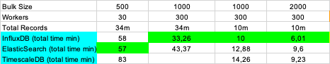
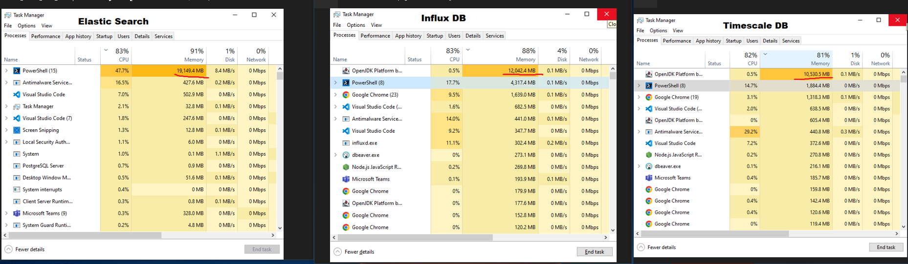

# ADR: Use REST to send data to the DSB and elasticsearch as timeseries database

|              |            |
|:-------------|:-----------|
| State        | `ACCEPTED`    |
| Created      | 2022-09-28 |
| Last Update  | 2022-09-28 |
| Participants | @tkurz     |

## Context
We assume that REST based bulk loads and a elasticsearch backend as timeseries database fulfills the basic system requirements.
The system should be build to be robust on high load and to support a certain kind of throughput.
A script based throughput measurement enables to us to verify the assumption.
A detailed description on how to run the experiment can be found [here](./../../loadtest/README.md).

## Experiment 1

### Setup
We use the current test instance as DSB. The REST gateway runs two instances, the elasticsearch is a pure, dockerized, un-tuned, single-node instance.
The client is a MAC M1 MAX (32GB) notebook with a WLAN connection (Upload ~16Mbps).
We send data in bulks of 500 datapoints and 30 parallel request workers.

### Results
The whole experiment results can be found in [fullload.xlsx](./../files/fullload.xlsx).
Wrote 34,3 Mio datapoints in ~51min which means 11135 datapoints per seconds.
_Duration per bulk_: AVG: 1345, MEDIAN: 1049, MAX: 12281, MIN: 411

## Experiment 2
In a second test we compared the elastic backend implementation with 2 alternatives, namely InfluxDB and TimescaleDB.
The results:

## Decision

It seems like with the current setup (Rest API) the difference between special timeseries databases like IndluxDB
and high-scale document stores like Elasticsearch is not huge. So for many use cases Elasticsearch is a convenient
setup, especially looking at the additional OpenSource features.

Nevertheless, the backend and all interactions should be encapsulated by well-defined interfaces und thus could be 
replaced later if necessary.

An abstraction layer for a storage and the transport layer will be provided allowing to integrate new storage and transport options. In the project we will firstly choose Elastic and REST.
